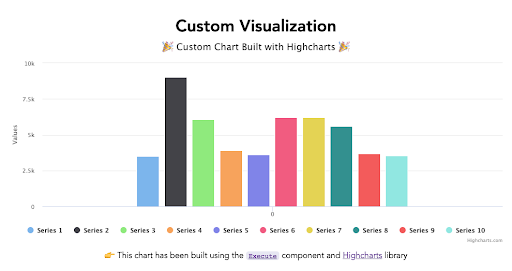

We have created a number of simple interactive examples using CodeSandbox.ui. Each example points to a CodeSandbox screen that includes a simple GoodData.UI code next to a resulting visualization.

Feel free to play with the sample code in your browser to see how the visualizations update just after changing the component properties - for your convenience, we have added hints to most of the examples.

Let’s start with a simple headline widget!

_Note: for the sake of simplicity, we have put a proxy in front of the GoodData platform so the sample code doesn’t need to worry about [authentication or single sign on](30_tips__sso.md)._

|  |  |
| :--- | :--- |
| Headline |  | 
| ComboChart |  | 
| RelativeDateFilter |  | 
| ChartConfig |  |
| PivotTable |  | 
| InsightView |  | 
| Execute |  | 
| Year Filter |  | 
| AttributeFilter |  | 
| Custom Attribute Filter |  |
| Granularity |  |
