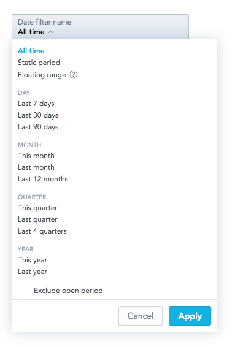

> **The DateFilter component is in the beta stage.**
>
> The DateFilter component may contain bugs. The component may be changed in future releases, even in a backward incompatible way.

> **Known issues**:
> - `availableGranularities` in `relativeForm` is ignored. `availableGranularities` from the DateFilter component is used instead.
>   - _This issue may be fixed in one of the future releases. The `availableGranularities` property may be removed from the DateFilter component._
> - The `name` property in `allTime`, `absoluteForm`, and `relativeForm` is ignored.
>   - _The built-in standard label is always used regardless of the value of the `name` property. The `name` property itself may be made optional in one of the future releases, which will make this a backward incompatible change._
>

The DateFilter component is a dropdown component that lists [date filter options](15_props__date_filter_option.md). You can pass allowed options and a callback function, which receives a list of the selected values when a user clicks **Apply**.

Optionally, you can define what attribute values should be selected in the filter by default.



### Example

In the following example, attribute values are listed and the ```onApply``` callback function is triggered when a user clicks **Apply** to confirm the selection.

```jsx harmony
import React, { Component } from "react";
import { DateFilter } from "@gooddata/react-components";
import { myDateFilterOptions } from "myDateFilterConfiguration";

import "@gooddata/react-components/styles/css/dateFilter.css";

const availableGranularities = [
    "GDC.time.month",
    "GDC.time.year",
    "GDC.time.quarter",
    "GDC.time.date"];

const dateFilterOptions = myDateFilterOptions();

export class DateFilterComponentExample extends Component {
    constructor(props) {
        super(props);

        this.state = {
            selectedFilterOption: dateFilterOptions.allTime,
            excludeCurrentPeriod: false,
        };
    }

    onApply = (dateFilterOption, excludeCurrentPeriod) => {
        this.setState({
            selectedFilterOption: dateFilterOption,
            excludeCurrentPeriod,
        });
        // eslint-disable-next-line no-console
        console.log(
            "DateFilterExample onApply",
            "selectedFilterOption:",
            dateFilterOption,
            "excludeCurrentPeriod:",
            excludeCurrentPeriod,
        );
    };

    render() {
        return (
            <div style={{ width: 300 }}>
                <DateFilter
                    excludeCurrentPeriod={this.state.excludeCurrentPeriod}
                    selectedFilterOption={this.state.selectedFilterOption}
                    filterOptions={dateFilterOptions}
                    availableGranularities={availableGranularities}
                    customFilterName="Date filter name"
                    dateFilterMode="active"
                    onApply={this.onApply}
                />
            </div>
        );
    }
}
```

**NOTE:** For the complete source code, see [Live Examples](https://gooddata-examples.herokuapp.com/).

## Properties

| Name | Required? | Type | Description |
| :--- | :--- | :--- | :--- |
| excludeCurrentPeriod | true | boolean | The state of the 'Exclude current period' checkbox |
| selectedFilterOption | true | [DateFilterOption](15_props__date_filter_option.md#types-of-DateFilter-options) | The selected filter option |
| filterOptions | true | [DateFilterOptions](15_props__date_filter_option.md#types-of-DateFilter-options) | Available filter options |
| availableGranularities | true | [DateFilterGranularity[]](15_props__date_filter_option.md#date-filter-granularity) | An array of available types of granularity for the Relative Form  |
| customFilterName | false | string | A custom filter label |
| dateFilterMode | true | string | Filter mode; can be `readonly`, `hidden`, or `active` |
| locale | false | string | The localization of the component. Defaults to `en-US`. For other languages, see the [full list of available localizations](https://github.com/gooddata/gooddata-ui-sdk/blob/master/libs/sdk-ui/src/base/localization/Locale.ts). |
| onApply | true | Function | A callback when the selection is confirmed by the user |
| onCancel | false | Function | A callback when the selection is canceled by the user |
| onOpen | false | Function | A callback when the filter dropdown is opened by the user |
| onClose | false | Function | A callback when the filter dropdown is closed by the user |
