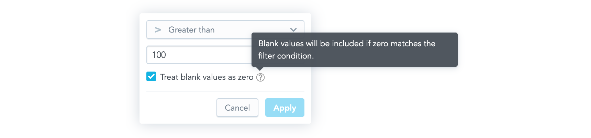
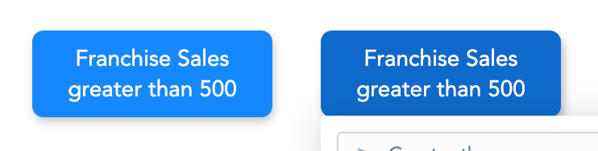

The Measure Value Filter component is a dropdown component that allows you to create a new [measure value filter](30_tips__filter_visual_components.md#filter-by-a-measure-value) or to edit an existing one. When a user clicks **Apply**, a callback function that contains a measure value filter ready to be used in the AFM is called.


## Structure

```javascript
import "@gooddata/react-components/styles/css/main.css";
import { MeasureValueFilter } from "@gooddata/react-components";

<MeasureValueFilter
  onApply={<on-apply-callback>}
  onCancel={<on-cancel-callback>}
  filter={<filter>}
  buttonTitle={<toggle-button-title>}
  usePercentage={<percentage-measure-boolean>}
  warningMessage={<warning-message>}
/>
```

## Example

The following example shows a bar chart displaying one measure sliced by one attribute. A user can use the Measure Value Filter component to filter the displayed bars and see the relevant data only.

```javascript
import React, { Component } from "react";
import "@gooddata/react-components/styles/css/main.css";
import {
  BarChart,
  Model,
  MeasureValueFilter
} from "@gooddata/react-components";

const measureTitle = "$ Total Sales";

const totalSales = Model.measure("totalSalesIdentifier")
  .format("#,##0")
  .localIdentifier("totalSales")
  .title(measureTitle);

const locationResort = Model.attribute(
  "locationResortIdentifier"
).localIdentifier("locationResort");

export default class SalesByResort extends Component {
    this.state = { filters: [] };

    onApply = filter => {
        this.setState({ filters: [filter] });
    };

    render() {
        const { filters } = this.state;

        return (
            <div>
                <MeasureValueFilter
                    onApply={this.onApply}
                    filter={filters[0]}
                    buttonTitle={measureTitle}
                />
                <BarChart
                    projectId={projectId}
                    measures={[totalSales]}
                    viewBy={[locationResort]}
                    filters={filters}
                />
            </div>
        );
    }
}
```

## Formatting user input

To format input inside the Measure Value Filter component, use separators. The separators are controlled by the `separators` property that specifies the thousands separator (`,` by default) and the decimal separator (`.` by default).

For example:

```javascript
<MeasureValueFilter
    ...
    separators={{ thousand: " ", decimal: "," }}
/>
```

## Treating null values as 0

By default, an execution containing a measure value filter does not pass null (missing) values to arithmetic operations.
However, you can allow users to make the execution treat the null values as 0 and include the null results in the filtering process.

To do so, enable the "Treat blank values as 0" checkbox in the filter dialog. By default, the checkbox is not selected.



To enable the checkbox, set the `displayTreatNullAsZeroOption` property to `true`.

To make it to be selected by default, set the `treatNullAsZeroDefaultValue` property to `true`.

```javascript
<MeasureValueFilter
    ...
    displayTreatNullAsZeroOption={true}
    treatNullAsZeroDefaultValue={true}
/>
```

## Properties

| Name                         | Required? | Type                                                            | Default                                   | Description                                                                                                                                                                                                                                                                                                                                   |
| :--------------------------- | :-------- | :-------------------------------------------------------------- | :---------------------------------------- | :-------------------------------------------------------------------------------------------------------------------------------------------------------------------------------------------------------------------------------------------------------------------------------------------------------------------------------------------- |
| filter                       | true      | [Filter](30_tips__filter_visual_components.md#filter-by-a-measure-value) |                                           | The measure value filter definition                                                                                                                                                                                                                                                                                                           |
| onApply                      | true      | Function                                                        |                                           | A callback when the selection is confirmed by a user. The passed configuration of the measure value filter is already transformed into a measure value filter definition, which you can then send directly to a chart.                                                                                                                        |
| onCancel                     | false     | Function                                                        |                                           | A callback when a user clicks the Cancel button or makes the dropdown close by clicking outside of it.                                                                                                                                                                                                                                        |
| buttonTitle                  | false     | string                                                          |                                           | The title of the toggle button                                                                                                                                                                                                                                                                                                                           |
| usePercentage                | false     | boolean                                                         | false                                     | Specifies whether the filtered measure is formatted as a percentage. If it is, the filter dropdown will accept percentage values, not the actual measure values. Set `usePercentage` to `false` when `computeRatio` is enabled in the filtered measure, because in this case it is filtered by actual measure values and not percentage ones. |
| warningMessage               | false     | string                                                          | undefined                                 | The warning message displayed in the dropdown                                                                                                                                                                                                                                                                                                 |
| separators                   | false     | [Separators](#formatting-user-input)                            | `,` for thousands; `.` for decimal points | Separators used for formatting strings in the input                                                                                                                                                                                                                                                                                           |
| displayTreatNullAsZeroOption | false     | boolean                                                         | false                                     | Specifies whether the ["Treat blank values as 0" checkbox](#Treating-null-values-as-0) is shown in the filter dialog                                                                                                                                                                                                                          |
| treatNullAsZeroDefaultValue  | false     | boolean                                                         | false                                     | Specifies whether the ["Treat blank values as 0" checkbox](#Treating-null-values-as-0) is selected by default                                                                                                                                                                                                                                 |
| locale                       | false     | string                                                          | `en-US`                                   | The localization of the component. See the [full list of available localizations](https://github.com/gooddata/gooddata-ui-sdk/blob/master/libs/sdk-ui/src/base/localization/Locale.ts).                                                                                                                                                                        |

## Custom toggle button

If you want to use your own custom button for toggling the filter dropdown, use the Measure Value Filter Dropdown component. This component renders only the dropdown body outside of the current DOM tree using [portals](https://reactjs.org/docs/portals.html).



The component has all the same properties as the Measure Value Filter component (see [Properties](#Properties)) with the following exceptions:
* The `buttonTitle` property is irrelevant for the  Measure Value Filter Dropdown component.
* The `onCancel` property is mandatory for the  Measure Value Filter Dropdown component, because it is supposed to be used to hide the dropdown.
* The Measure Value Filter Dropdown component has one additional property, `anchorEl`. This optional property specifies the element which the dropdown is aligned to, which is typically your toggle button. The property can be an event target or a string and defaults to `'body'`.

The following is an example of using the Measure Value Filter Dropdown component:

```javascript
import React, { Component } from "react";
import "@gooddata/react-components/styles/css/main.css";
import {
  BarChart,
  Model,
  MeasureValueFilterDropdown
} from "@gooddata/react-components";

const measureTitle = "$ Total Sales";

const totalSales = Model.measure("totalSalesIdentifier")
  .format("#,##0")
  .localIdentifier("totalSales")
  .title(measureTitle);

const locationResort = Model.attribute(
  "locationResortIdentifier"
).localIdentifier("locationResort");

export default class SalesByResort extends Component {
    this.state = { filters: [], displayDropdown: false };

    onApply = filter => {
        this.setState({ filters: [filter], displayDropdown: false });
    };

    onCancel = () => {
        this.toggleButtonRef = null;
        this.setState({ displayDropdown: false });
    };

    toggleDropdown = e => {
        this.toggleButtonRef = !this.state.displayDropdown ? e.currentTarget : null;
        this.setState(state => ({ ...state, displayDropdown: !state.displayDropdown }));
    };

    render() {
        const { filters, displayDropdown } = this.state;

        return (
            <div>
                <button onClick={this.toggleDropdown}>{`Measure: ${measureTitle}`}</button>
                {displayDropdown ? (
                    <MeasureValueFilterDropdown
                        onApply={this.onApply}
                        onCancel={this.onCancel}
                        filter={filters[0]}
                        anchorEl={this.toggleButtonRef}
                    />
                ) : null}
                <BarChart
                    projectId={projectId}
                    measures={[totalSales]}
                    viewBy={[locationResort]}
                    filters={filters}
                />
            </div>
        );
    }
}
```
