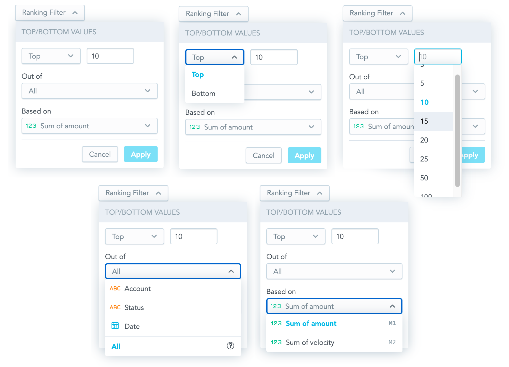
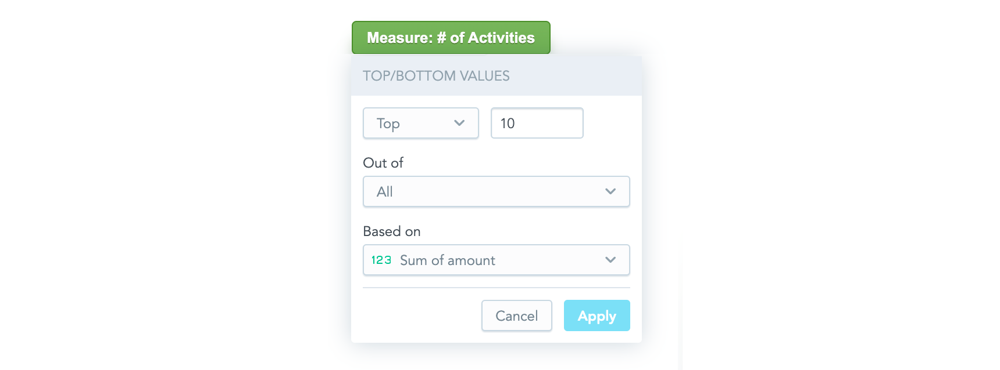

The **Ranking Filter component** is a dropdown component that allows you to create a new [ranking filter](30_tips__filter_visual_components.md#ranking-filter) or to edit an existing one. When a user clicks **Apply**, a callback function that contains a ranking filter ready to be used in the visualization component is called.



## Structure

```jsx
import "@gooddata/sdk-ui-filters/styles/css/main.css";
import { MeasureValueFilter } from "@gooddata/sdk-ui-filters";

<RankingFilter
  onApply={<on-apply-callback>}
  onCancel={<on-cancel-callback>}
  filter={<filter>}
  buttonTitle={<toggle-button-title>}
  measureItems={<visualization-measures>}
  attributeItems={<visualization-attributes}
/>
```     

## Example

The following example shows a table displaying one measure sliced by one attribute. A user can use the Ranking Filter component to filter the displayed rows and see the relevant data only.

```jsx
import React, { useState } from "react";
import { PivotTable } from "@gooddata/sdk-ui-pivot";
import { newRankingFilter, localIdRef, measureLocalId, attributeLocalId } from "@gooddata/sdk-model";
import { RankingFilter, IMeasureDropdownItem, IAttributeDropdownItem } from "@gooddata/sdk-ui-filters"; 
import { LdmExt } from "../../ldm";

const measures = [LdmExt.FranchiseFees, LdmExt.FranchisedSales];
const attributes = [LdmExt.LocationState, LdmExt.LocationName];

const measureDropdownItems: IMeasureDropdownItem[] = [
    {
        title: "Franchise fees",
        ref: localIdRef(measureLocalId(LdmExt.FranchiseFees)),
        sequenceNumber: "M1",
    },
    {
        title: "Franchised sales",
        ref: localIdRef(measureLocalId(LdmExt.FranchisedSales)),
        sequenceNumber: "M2",
    },
];
const attributeDropdownItems: IAttributeDropdownItem[] = [
    {
        title: "Location state",
        ref: localIdRef(attributeLocalId(LdmExt.LocationState)),
        type: "ATTRIBUTE",
    },
    {
        title: "Location",
        ref: localIdRef(attributeLocalId(LdmExt.LocationName)),
        type: "ATTRIBUTE",
    },
];
export const RankingFilterExample: React.FC = () => {
    const [filter, setFilter] = useState(newRankingFilter(LdmExt.franchiseSalesLocalId, "TOP", 3));
    return (
        <React.Fragment>
            <RankingFilter
                measureItems={measureDropdownItems}
                attributeItems={attributeDropdownItems}
                filter={filter}
                onApply={(filter) => setFilter(filter)}
                buttonTitle={"Ranking filter"}
            />
            <hr className="separator" />
            <div style={{ height: 300 }} className="s-pivot-table">
                <PivotTable 
                    measures={measures} 
                    rows={attributes} 
                    filters={[filter]} 
                />
            </div>
        </React.Fragment>
    );
};
```
## Properties

| Name                         | Required? | Type                                                            | Default                                   | Description                                                                                                                                                                                                                                                                                                                                   |
| :--------------------------- | :-------- | :-------------------------------------------------------------- | :---------------------------------------- | :-------------------------------------------------------------------------------------------------------------------------------------------------------------------------------------------------------------------------------------------------------------------------------------------------------------------------------------------- |
| measureItems                 | true      | Object with the measure's `title` (string) and `ref` (ObjRefInScope) properties                                                                |                                           | The list of available measures from which a user can choose the measure to apply the filter to; typically, the list of the measures used in the visualization                                                                                                    |
| attributeItems                 | false      | Object with the attribute's `title` (string) or `ref` (ObjRefInScope) properties. The optional `type` property (with a possible string value of either `"ATTRIBUTE"` or `"DATE"`) affects the rendered option's icon.                                                               |                                           | The list of available attributes from which a user can choose the attribute to apply the filter to; typically, the list of the attributes used in the visualization that defines the visualization granularity. When the property is not provided, the filter behaves as if all the attributes were selected (the visualization default granularity was set) .|
| filter                       | true      | [Filter](30_tips__filter_visual_components.md#ranking-filter) |                                           | The ranking filter definition                                                                                                                                                                                                                                                                                                           |
| onApply                      | true      | Function                                                        |                                           | A callback when the selection is confirmed by a user. The passed configuration of the ranking filter is already transformed into a ranking filter definition, which you can then send directly to a chart.                                                                                                                        |
| onCancel                     | false     | Function                                                        |                                           | A callback when a user clicks the Cancel button or makes the dropdown close by clicking outside of it                                                                                                                                                                                                                                        |
| buttonTitle                  | false     | string                                                          |                                           | The title of the toggle button                                                                                                                                                                                                                                                                                                                           |
| locale                       | false     | string                                                          | `en-US`                                   | The localization of the component. See the [full list of available localizations](https://github.com/gooddata/gooddata-ui-sdk/blob/master/libs/sdk-ui/src/base/localization/Locale.ts).                                                                                                                                                                        |

## Custom toggle button

If you want to use your own custom button for toggling the filter dropdown, use the Ranking Filter Dropdown component. This component renders only the dropdown body outside of the current DOM tree using [portals](https://reactjs.org/docs/portals.html).



The component has all the same properties as the Ranking Filter component (see [Properties](#Properties)) with the following exceptions:
* The `buttonTitle` property is irrelevant for the Ranking Filter Dropdown component.
* The `onCancel` property is mandatory for the Ranking Filter Dropdown component, because it is supposed to be used to hide the dropdown.
* The Ranking Filter Dropdown component has one additional property, `anchorEl`. This optional property specifies the element that the dropdown is aligned to, which is typically your toggle button. The property can be an event target or a string and defaults to `'body'`.

Check out our [live examples](https://github.com/gooddata/gooddata-ui-sdk/tree/master/examples/sdk-examples) for demonstration.
