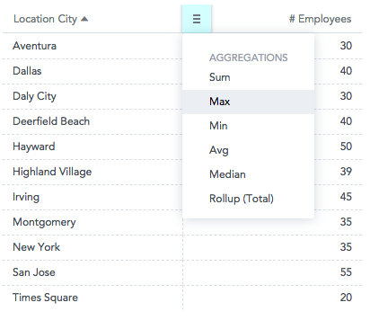

Pivot table component expands capabilities of a regular (flat) table by allowing you to reorganize and summarize selected data beyond the typical row-column relationship.

In GoodData.UI, a pivot table allows you to break measures into columns by setting attributes in the ```columns``` prop. You can also choose to display only attributes (without any measures). On the other hand, a flat table cannot display attributes in columns.

Compared to charts, pivot tables have higher limits for the number of datapoints to display.

The following pivot table shows franchise fees (a measure), which are split down by location state (an attribute) horizontally and by month (a column attribute) vertically.


## Structure

```jsx
import '@gooddata/react-components/styles/css/main.css';
import { PivotTable } from '@gooddata/react-components';

<PivotTable
    projectId={<project-id>}
    measures={<measures>}
    sdk={<sdk>}
    …
/>
```

## Examples

### Pivot table

The following code sample shows an arrangement for a typical pivot table.

```jsx
const measures = [
    {
        measure: {
            localIdentifier: 'franchiseFees',
            definition: {
                measureDefinition: {
                    item: {
                        identifier: franchiseFeesIdentifier
                    }
                }
            },
            format: '#,##0'
        }
    }
];

const columns = [
    {
        visualizationAttribute: {
            displayForm: {
                identifier: monthDateIdentifier
            },
            localIdentifier: 'month'
        }
    }
];

const rows = [
    {
        visualizationAttribute: {
            displayForm: {
                identifier: locationStateDisplayFormIdentifier
            },
            localIdentifier: 'location'
        }
    }
];

<div style={{ height: 300 }}>
    <PivotTable
        projectId={projectId}
        measures={measures}
        rows={rows}
        columns={columns}
    />
</div>
```

### Flat table

You can also use the pivot table component to create a regular (flat) table.

```jsx
const measures = [
    {
        measure: {
            localIdentifier: 'franchiseFees',
            definition: {
                measureDefinition: {
                    item: {
                        identifier: franchiseFeesIdentifier
                    }
                }
            },
            format: '#,##0'
        }
    }
];

const rows = [
    {
        visualizationAttribute: {
            displayForm: {
                identifier: locationStateDisplayFormIdentifier
            },
            localIdentifier: 'location'
        }
    }
];

<div style={{ height: 300 }}>
    <PivotTable
        projectId={projectId}
        measures={measures}
        rows={rows}
        columns={columns}
    />
</div>
```

## Sorting in pivot tables

You can [sort](result_specification.md#sorting) rows and attribute columns in any pivot table. Measures are always listed in the same order in which they were defined in the ```measures``` prop.

**Important!** Sorting must be applied to any column attribute that is used in the pivot table. For example, in the table above, you apply sorting to both the Franchise Fees (measure) and the Date (column attribute).

### Example: Sorting by measure

```jsx
// ...using Pivot Table Example

const sortBy = [
    {
        measureSortItem: {
            direction: 'desc',
            locators: [
                {
                    attributeLocatorItem: {
                        attributeIdentifier: 'month',
                        element: monthDateIdentifierJanuary
                    }
                },
                {
                    measureLocatorItem: {
                        measureIdentifier: 'franchiseFeesIdentifier'
                    }
                }
            ]
        }
    }
];

<div style={{ height: 300 }}>
    <PivotTable
        projectId={projectId}
        measures={measures}
        rows={rows}
        columns={columns}
        sortBy={sortBy}
    />
</div>
```

## Grouping

By default, the same values in column attributes are grouped across the rows, which helps improve data readability in pivot tables. The header of the grouped columns is displayed at the top of the table even when you scroll through a long group.

The grouping is applied when the following conditions are both met:
* The table is sorted by the **first** column attribute (either in ascending or descending order).
* The table has **two or more** column attributes.


To disable grouping, set the `groupRows` property to `false` (see [Properties](#properties)).

## Totals

You can display rows with aggregated measure data using the `totals` prop. For more information, see [Specify Table Totals](table_totals.md).

Alternatively, you can enable the menu through which you can turn on the totals and subtotals. For more information, see [Configuration menu](#configuration-menu).



## Maximum height

By default, the maximum hight is not specified, and the pivot table fills the whole container. If there is still some empty space within the container after all the rows have been displayed, and the table has a total specified, a gap may appear between the data and the total because the total row sticks to the bottom.

To avoid this gap, specify the maximum height of the table using the `maxHeight` prop. With the `maxHeight` set, the table is displayed as small as possible while not expanding beyond the `maxHeight` limit, thus avoiding the gap. For more information, see [Configuration menu](#configuration-menu).

**NOTE:** The `maxHeight` must be specified in pixels. If you want your table to be responsive, consider using [react-measure](https://github.com/souporserious/react-measure) to derive the `maxHeight` value dynamically.

## Column width resizing

By default, the width of the columns is not set, and all columns have the same fixed width regardless of the actual content. To automatically resize the columns to fit their content, add the `columnSizing` prop and set it to `defaultWidth: "viewport"`:
```
columnSizing: {
    defaultWidth: "viewport"
}
```
* The size is calculated based on the content in the header of the column that represents the lowest level of the grouped attributes (see [Grouping](#grouping)). If this is not applicable, the size is calculated based on the content in the header of the column with the measure name and the cells with the measure values.
* Only the columns that are visible during the initial rendering of the table are automatically resized to fit their content.
* New columns (that is, those that are shown after the initial render) are resized only if the table has not been vertically or horizontally scrolled. This is useful especially for responsive tables with the dynamic width.
* A change of attributes, measures, filters, or totals in the table is handled as a new table. After the change is made, the column size is re-calculated based on the new data.
* Scrolling horizontally or vertically and sorting values in a column do not affect the column width.
* If you manually adjust the column width, the adjusted width is preserved only temporarily and will be reset to the previously set value after the table is re-rendered.
* When auto-resizing is turned on, the column width can be set to 500 px maximum (for both auto-resized and manually resized columns).

To switch to the default behavior (all columns have the same fixed size), set the `columnSizing` prop to `defaultWidth: "unset"` or do not provide `columnSizing` at all.

## Configuration menu

You can configure the following settings:
* **Totals** and **subtotals**. If you enable the subtotals menu but disable totals, subtotals will be disabled too.
* **Separators** used when formatting numbers. See [Change a separator in the number format](chart_config.md#Change-a-separator-in-the-number-format).
* **Maximum height**. See [Maximum height](#maximum-height).
* **Column width resizing**. See [Column width resizing](#column-width-resizing).

```jsx
const config = {
    maxHeight: 800,
    menu: {
        aggregations: true,
        aggregationsSubMenu: true
    },
    separators: {
        thousand: ',',
        decimal: '.'
    },
    columnSizing: {
        defaultWidth: "viewport"
    }
};

<PivotTable
    projectId={projectId}
    measures={measures}
    rows={rows}
    columns={columns}
    sortBy={sortBy}
    config={config}
/>
```

## Properties

| Name | Required? | Type | Description |
| :--- | :--- | :--- | :--- |
| projectId | true | string | The project ID |
| measures | false | [Measure[]](afm.md#measure) | An array of measure definitions (either measures, or rows, or columns must be provided for the pivot table to render properly) |
| rows | false | [Attribute[]](afm.md#attribute) | An array of attribute definitions that breaks measure data into rows (either measures, or rows, or columns must be provided for the pivot table to render properly) |
| columns | false | [Attribute[]](afm.md#attribute) | An array of attribute definitions that breaks measure data into columns (either measures, or rows, or columns must be provided for the pivot table to render properly) |
| totals | false | [Total[]](table_totals.md) | An array of total definitions |
| filters | false | [Filter[]](filter_visual_components.md) | An array of filter definitions |
| config | false | [ConfigObject](#configuration-menu) | The configuration object |
| sortBy | false | [SortItem[]](result_specification.md#sorting) | An array of sort definitions |
| groupRows | false | boolean | Specifies whether [grouping of the same values in attribute columns](#grouping) is enabled (`true`; default) or disabled (`false`). |
| locale | false | string | The localization of the table. Defaults to `en-US`. For other languages, see the [full list of available localizations](https://github.com/gooddata/gooddata-react-components/tree/master/src/translations). |
| drillableItems | false | [DrillableItem[]](drillable_item.md) | An array of points and attribute values to be drillable. |
| sdk | false | SDK | A configuration object where you can define a custom domain and other API options |
| ErrorComponent | false | Component | A component to be rendered if this component is in error state. See [ErrorComponent](error_component.md).|
| LoadingComponent | false | Component | A component to be rendered if this component is in loading state. See [LoadingComponent](loading_component.md).|
| onError | false | Function | A callback when the component updates its error state |
| onExportReady | false | Function | A callback when the component is ready for exporting its data |
| onLoadingChanged | false | Function | A callback when the component updates its loading state |

<!-- These internals are intentionally undocumented
| afterRender | false | Function | A callback after component is rendered |
| dataSource | false | DataSource class | A class that is used to resolve AFM |
| height | false | number | Height of the component in pixels |
| pushData | false | Function | A callback after AFM is resolved |
-->
